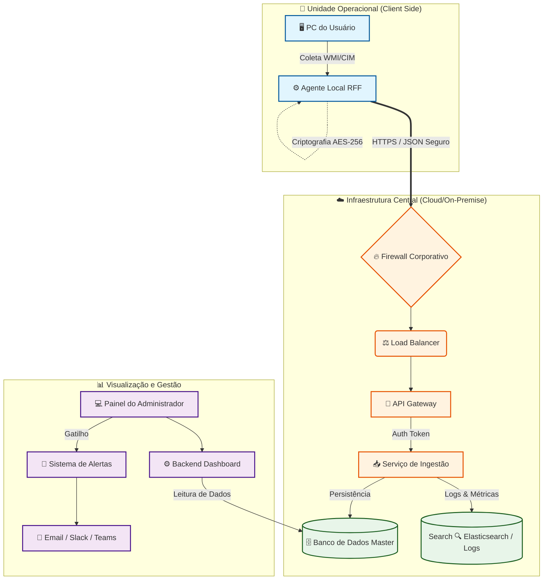

# 🛡️ Sistema de Gestão de Ativos e Monitoramento de TI

> Um ecossistema completo de governança de TI desenvolvido para a **Rede Fácil Financeira**, focado em monitoramento em tempo real, automação de segurança e gestão centralizada de patrimônio.

## 📖 Sobre o Projeto

Este sistema foi projetado para solucionar o desafio de gerenciar o parque tecnológico de uma instituição financeira. Ele atua como uma **Central de Comando Unificada**, permitindo que a equipe de TI monitore a saúde das máquinas, preste suporte remoto instantâneo e mantenha um inventário rigoroso de hardware e software.

O diferencial deste projeto é o seu foco em **Segurança da Informação e Compliance**, garantindo que todas as operações e dados sensíveis estejam protegidos e em conformidade com a **LGPD**.

---

## 🚀 Funcionalidades Principais

### 🖥️ Monitoramento e Controle
- **Dashboard em Tempo Real:** Visualização ao vivo de CPU, Memória RAM, Temperatura e Saúde do Disco de todas as máquinas da unidade.
- **Alertas Inteligentes:** Notificações automáticas caso uma máquina atinja **90% de uso de CPU** ou seja desligada/desconectada em horário comercial.
- **Controle Remoto:** Execução de scripts (PowerShell/Batch), reinicialização de serviços e comandos administrativos sem interromper o usuário.

### 🔐 Segurança e LGPD (Cofre Digital)
- **Cofre de Senhas:** Módulo criptografado para armazenamento seguro de senhas de servidores, e-mails corporativos, PINs e acessos bancários.
- **Compliance:** Estrutura de dados desenhada para garantir a rastreabilidade e segurança das informações, eliminando o uso de planilhas inseguras.

### 📦 Gestão de Patrimônio e Inventário
- **Ciclo de Vida do Ativo:** Controle de status (Em Uso, Disponível, Defeito, Manutenção) de desktops, periféricos e infraestrutura.
- **Gerador de Etiquetas QR Code:** Criação automática de etiquetas patrimoniais para identificação física e acesso rápido aos dados do equipamento via scan.
- **Gestão de Telefonia:** Controle centralizado de chips corporativos e aparelhos móveis.

### ⚙️ Automação e Manutenção (Green IT)
- **Desligamento Automático:** Rotina programada para desligar todas as máquinas após o expediente, economizando energia.
- **Ponto de Restauração Automático:** Criação periódica de backups de estado do sistema (Windows Restore Points) para recuperação rápida em caso de falhas ou ataques.
- **Central de Chamados:** Agente instalado na máquina do usuário permite abertura de tickets instantâneos para o suporte.

### 🗺️ Infraestrutura
- **Mapa de Rede:** Visualização lógica dos IPs e localização física das máquinas por setor (Comercial, Monitoria, Operacional).

---

## 🔒 Segurança e Privacidade (LGPD)

A arquitetura deste software segue os princípios de *Privacy by Design*. As seguintes medidas foram implementadas para garantir a conformidade com a Lei Geral de Proteção de Dados:

1.  **Criptografia:** Dados sensíveis armazenados no Cofre Digital são criptografados no banco de dados.
2.  **Controle de Acesso:** Níveis de permissão rigorosos garantem que apenas administradores autorizados visualizem dados críticos ou executem comandos remotos.
3.  **Auditoria:** O sistema mantém logs de quem acessou o quê e quando, garantindo a responsabilização (accountability).
4.  **Integridade:** O monitoramento proativo e os pontos de restauração garantem a disponibilidade e integridade dos dados da empresa.

---

## 🛠️ Tecnologias Utilizadas

- **Frontend:** React.js / Vue.js / HTML5 & CSS3]
- **Backend:** Node.js
- **Banco de Dados:** MySQL
- **Agente Desktop:** GoLang
- **Infraestrutura:** Docker / Windows Server

---

## 🏗️ Arquitetura da Solução

O sistema foi desenhado seguindo uma arquitetura de Microsserviços Event-Driven, garantindo que o monitoramento de milhares de máquinas não sobrecarregue a rede da empresa.

### Diagrama de Fluxo de Dados

